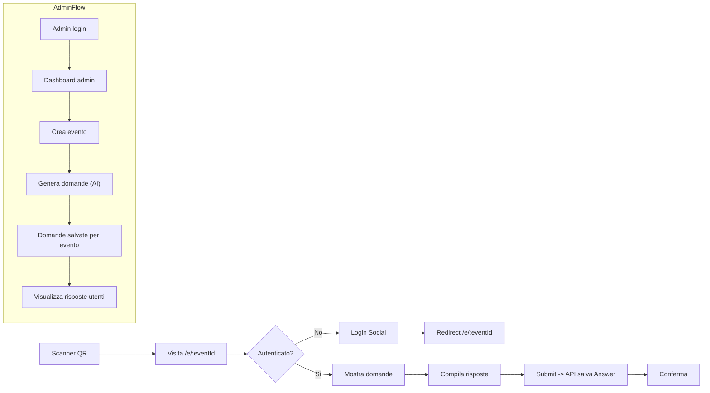

# SPEC - App eventi Spindox (Next.js 16 + shadcn + TailwindCSS v4)

Scopo

- App per eventi tech: far conoscere Spindox tramite Q&A ai partecipanti.
- Accesso via QR: partecipante scansiona, arriva alla pagina evento e risponde dopo login social.
- Ruoli: admin e user. Admin crea eventi e gestisce domande/risposte. User risponde alle domande.

Stack tecnico

- Next.js 16 (App Router)
- TailwindCSS v4 + shadcn-ui per componenti
- React Hook Form + Zod v4 per validazione
- Autenticazione e gestione utenti: Supabase (Auth + Postgres), usare Supabase client (non NextAuth)
- DB: Supabase (Postgres) — usare tabelle e RLS, non Prisma
- AI: usare #fetch dall'AI SDK (https://ai-sdk.dev) e instradare le richieste tramite Vercel AI Gateway (https://vercel.com/ai-gateway)
- QR code: generazione URL evento (es. /e/[eventId]?qr=...)

Principali pagine / route

- /login — login social (separato o modal)
- /admin — dashboard admin (protezione: role=admin)
  - /admin/events — lista eventi, crea/modifica/cancella
  - /admin/events/[id] — dettaglio evento: domande generate, risposte utenti (filtri)
- /e/[eventId] — pagina pubblica evento (accesso via QR o link)
  - mostra titolo/descrizione e lista domande
  - richiede login social prima di poter rispondere
- /api/\* — API REST/route handlers per eventi, domande, risposte, AI

Autenticazione e autorizzazione

- Login via provider social gestito da Supabase Auth (sessione JWT)
- Session contiene user.id, user.role (admin|user), name, email gestiti in una tabella users su Supabase
- Middleware (App Router middleware.ts) per redirigere utenti non autorizzati:
  - Protegge /admin\* solo per admin (verificare role da Supabase session / DB)
  - Protegge /e/[eventId]/submit (o la pagina /e/[eventId] per rispondere) richiede autenticazione
- Dopo login l'user deve rimanere confinato: gli utenti con role=user non possono accedere alle pagine admin (percepite come 403/redirect)

Modello dati (Supabase - tabelle consigliate)

- users: id (uuid, auth.id), name, email, role (enum 'admin'|'user'), created_at
- events: id (uuid), title, description, qr_code_url, created_by (users.id), created_at, status
- questions: id (uuid), event_id, text, choices (json array of { id, text }), correct_choice (string or index) -- NOT returned to clients, created_at, generated_by_ai boolean
- answers: id (uuid), question_id, user_id, selected_choice (string or index), is_correct (boolean, computed server-side), content (optional free text), created_at
- audit: optional scansions/visits (event_id, ip, user_agent, created_at)

Flusso funzionale (breve)

1. Admin login -> crea evento (titolo, descrizione).
2. Admin clicca "Genera domande" -> chiamata server-side a funzione AI che ritorna esattamente 4 domande; per ogni domanda l'AI restituisce testo, array di choices e la correct_choice. Il server salva questions con choices e correct_choice (campo server-only).
3. Admin copia QR code/link evento.
4. Utente scansiona QR -> naviga a /e/[eventId].
5. Se non autenticato mostra bottone "Login via provider". Dopo login lato client fetch domande. Il payload delle domande inviato al client deve includere solo text e choices (MAI correct_choice).
6. Utente seleziona una scelta per ogni domanda -> invia selected_choice per ciascuna domanda al endpoint POST /api/questions/:id/answers. Il server confronta selected_choice con correct_choice, calcola is_correct e salva Answer con is_correct boolean.
7. Admin visualizza risposte aggregate per domanda (tabella, filtri, percentuale corrette).

API endpoints suggeriti

- GET /api/events — lista eventi (admin: tutti, user: pubblici) — verificare sessione via Supabase
- POST /api/events — crea evento (admin) — usare Supabase server key o endpoint edge con verifica role
- GET /api/events/:id — dettaglio evento + domande (quando risponde un user: le domande ritornate includono text e choices; NON includere correct_choice)
- POST /api/events/:id/generate-questions — genera esattamente 4 domande via AI (admin) — la funzione AI deve restituire per ogni domanda: text, choices[], correct_choice; il server salva choices e correct_choice (correct_choice memorizzata solo nel DB e non esposta alle API pubbliche)
- POST /api/questions/:id/answers — salva risposta (autenticato user). Payload: { selected_choice: string|index }. Server: valida sessione Supabase, recupera question.correct_choice, calcola is_correct = (selected_choice == correct_choice), salva answer con selected_choice e is_correct, ritorna solo conferma e is_correct eventualmente (se si vuole confermare immediatamente), NON ritornare correct_choice.
- GET /api/events/:id/answers — lista risposte (admin) (include is_correct per analisi)

Considerazioni di sicurezza e privacy (aggiunta)

- Non includere mai correct_choice nel payload delle API verso client/user.
- Tutta la logica di valutazione (matching selected_choice vs correct_choice) deve essere eseguita server-side.
- Limitare tentativi / prevenire replay: usare constraint DB per evitare più risposte duplicate per stessa domanda/user o implementare logica server-side.
- Audit: salvare trace di generazione AI (input prompt, modello, timestamp) ma non esporre correct_choice in log pubblici.

Protezione delle pagine

- Usare middleware.ts per controllo sessione/role.
- Tutte le API devono validare session e role server-side.

Interfaccia Admin (shadcn)

- Lista eventi: card/table con azioni (edit, delete, generate questions, QR)
- Evento dettaglio: lista domande (edit), per ogni domanda tabella risposte (utente, testo, timestamp)
- Modal per creare evento (form con react-hook-form + zod)

Interfaccia User

- Pagina evento: titolo + description, domanda per domanda (one-by-one o lista)
- Form con react-hook-form: invio singolo per domanda o invio bulk
- Dopo invio mostra conferma e non permette duplicati (per domanda per user) o permette aggiornamento secondo regole

Sicurezza & Privacy

- Proteggere API con server session checks.
- Rate limiting per endpoint AI e per submit risposte.
- Anonimizzazione opzione per risposte se richiesto.
- Conservazione minima dei dati personali.

Deployment

- Variabili: SUPABASE_URL, SUPABASE_ANON_KEY, SUPABASE_SERVICE_ROLE_KEY, VERCEL_AI_GATEWAY_KEY, OPENAI_KEY (se usato)
- Hosting: Vercel / Fly / Render con segreto e configurazioni.
- Migrazioni/seed: usare SQL migration su Supabase o SQL files per seed demo.

Esempio di flusso mermaid

Note operative e priorità MVP

- MVP minimo: auth social, CRUD eventi, generazione domande (anche semi-manuale), pagina evento con login e submit risposte, admin view risposte.
- Funzionalità avanzate: analytics, export CSV, moderazione domande, scheduling eventi, supporto multi-lingua.
